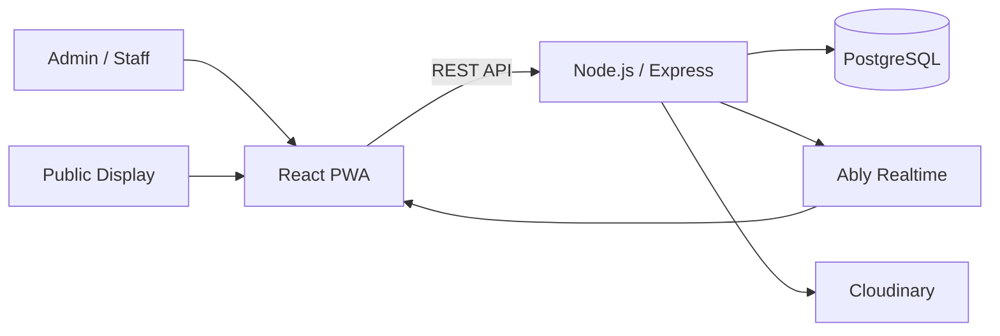
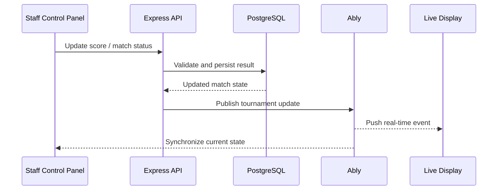

<div align="center">

# FIFA Tournament Engine#

**Real-time tournament operations platform built for live competitive gaming events.**

Built and delivered by **The Software Guys** for a **30-day sponsored FIFA tournament** organized by **PS5Hub** in collaboration with **Fogg**.


</div>

---

## Overview#

FIFA Tournament Engine is a full-stack tournament management system designed to run live gaming competitions from a single operational platform.

The system handles tournament setup, teams, schedules, match control, live scores, standings, public displays, administration, and real-time synchronization across connected devices.

It was originally built for real event operations, where reliability, fast updates, and simple staff control were more important than a typical demo-style tournament application.

## Production Context

| | |
| --- | --- |
| **Client** | PS5Hub |
| **Event collaboration** | PS5Hub × Fogg |
| **Software delivery** | The Software Guys |
| **Event duration** | 30 days |
| **Primary use** | Live FIFA tournament operations and broadcast/display synchronization |

## Core Features

- Tournament creation and configuration
- Multiple tournament formats and progression rules
- Team and participant management
- Match scheduling and operational control
- Live score and match-status updates
- Automatic standings and tournament progression
- Home/away match support
- Real-time synchronization across connected screens and devices
- Dedicated control and public display interfaces
- Role-based access for staff and administrators
- Tournament branding and sponsor presentation
- Business, finance, subscription, and device-management modules
- Progressive Web App support for resilient event operation

## Architecture

The application follows a modular full-stack architecture with a React client, REST API, PostgreSQL database, and Ably-powered real-time communication.



### Backend

The backend is organized by domain, including authentication, tournaments, users, businesses, finance, media, live state, and real-time communication.

Tournament writes that affect multiple records use database transactions to protect data consistency, while progression logic manages tournament state and advancement.

### Frontend

The frontend provides separate operational views for tournament administration, match control, dashboards, scheduling, branding, and live displays. Route-level protection and role guards restrict administrative functionality based on the authenticated user's role.

## Tech Stack

| Layer | Technologies |
| --- | --- |
| **Frontend** | React 19, Vite, React Router, Tailwind CSS, Zustand, Framer Motion |
| **Backend** | Node.js, Express.js, REST APIs |
| **Database** | PostgreSQL, raw SQL, transactional writes |
| **Real-Time** | Ably |
| **Authentication** | JWT, bcrypt |
| **Validation & Security** | Zod, Helmet, CORS, Express Rate Limit |
| **Media** | Cloudinary, Multer |
| **Offline / PWA** | Vite PWA |
| **Development** | Docker Compose, ESLint, npm |

## Real-Time Match Flow



This allows score changes and match-state updates to propagate without requiring every connected display to continuously poll the backend.

## Security & Data Integrity

- JWT-based authentication
- Role-based authorization for staff and administrators
- Zod request validation
- Helmet security headers
- API rate limiting
- Password hashing with bcrypt
- PostgreSQL transactions for multi-step writes
- Match confirmation and progression controls
- Protected administrative routes

## Project Structure

```text
fifa-tournament-engine/
├── backend/
│   └── src/
│       └── modules/
│           ├── ably/
│           ├── auth/
│           ├── businesses/
│           ├── finance/
│           ├── live-state/
│           ├── media/
│           ├── tournaments/
│           └── users/
├── src/
│   ├── app/
│   ├── auth/
│   ├── components/
│   ├── i18n/
│   ├── pages/
│   ├── services/
│   ├── store/
│   └── utils/
├── deploy/
├── docker-compose.dev.yml
└── package.json
```

## Running Locally

### 1. Install dependencies

```bash
npm install
npm --prefix backend install
```

### 2. Configure environment variables

Create the required frontend and backend environment files with your PostgreSQL, JWT, Ably, and media-service credentials.

### 3. Start the development database and run migrations

```bash
npm run db:up
npm run db:migrate
```

### 4. Start frontend and backend

```bash
npm run dev:all
```

Or run the complete development flow:

```bash
npm run dev:full
```

## Engineering Focus

This project was built around the requirements of a live event rather than a static tournament demo. The main engineering priorities were:

- reliable tournament state
- real-time synchronization
- operational simplicity for event staff
- data integrity during match progression
- role-based administrative control
- resilient PWA behavior
- reusable tournament and business modules

---

<div align="center">

**Built by [The Software Guys](https://github.com/Eyad20210197/The-Software-Guys)**  
Developed by [Eyad Aboelftoh](https://github.com/Eyad20210197) & [Roba Ahmed](https://github.com/Robaa18)

</div>
